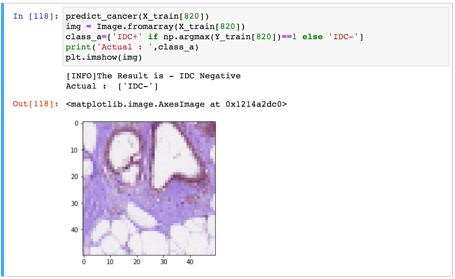

# Cancer-Prediction
Prediction for Breast Cancer - IDC+ or IDC-

As breast cancer is the most common type of cancer in woman and just in 2012 there are 1.70 million cases. As there is an abundant data for the early stage of prediction with cancer positive or negative. 

Prerequsites to run the project:

* Install python3, jupyter-notebook  and pip package manager.
* Download the dataset from Kaggle website in the root directory of the project. Download Link: https://www.kaggle.com/paultimothymooney/breast-histopathology-images

How To Run the Project:

* Run the CancerML.ipynb in Jupyter Notebook

Output:

